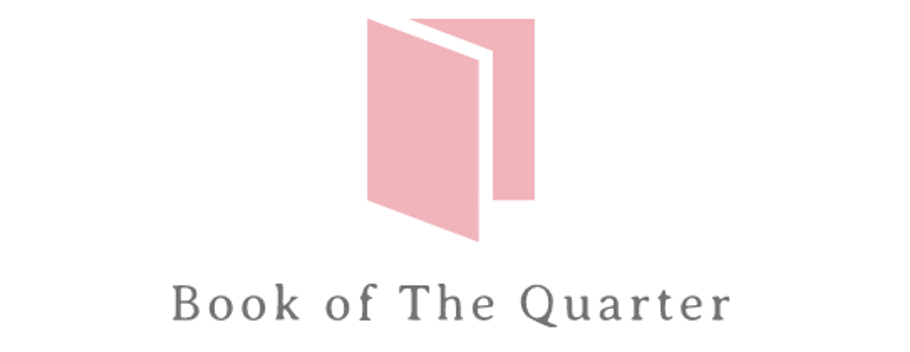
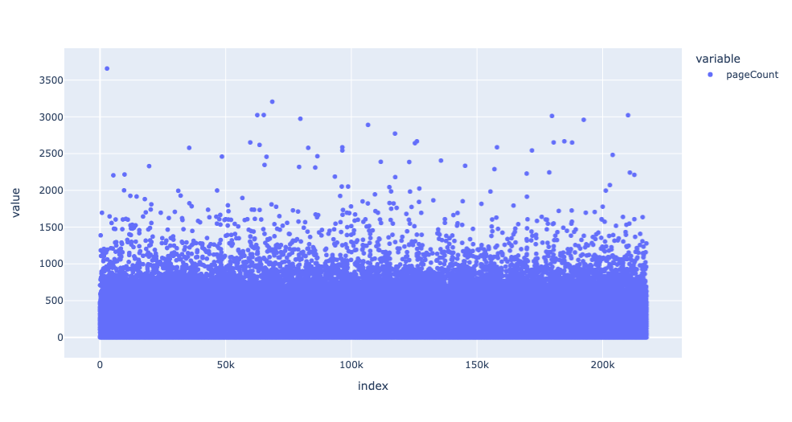
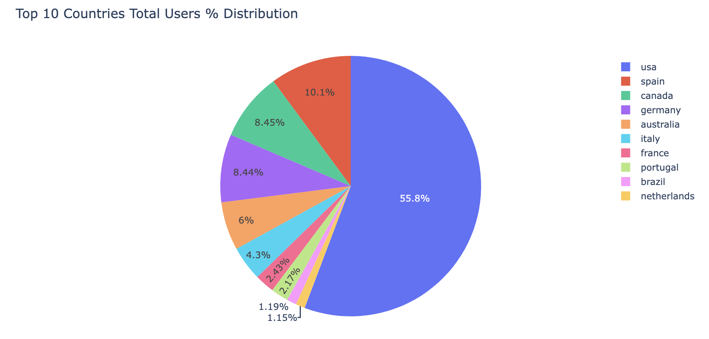
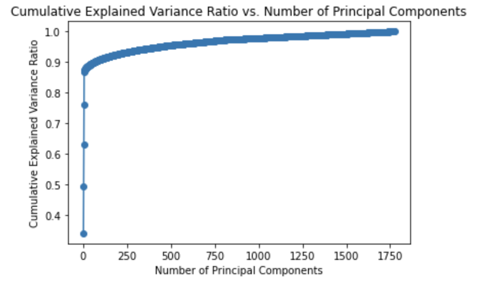
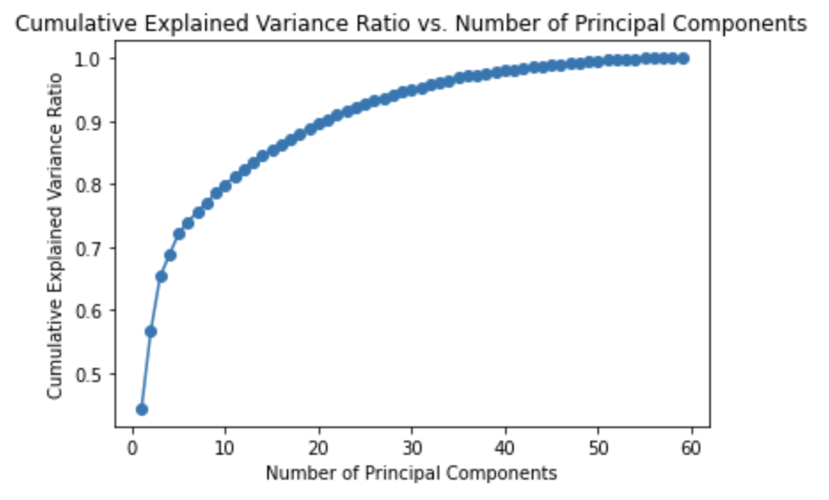
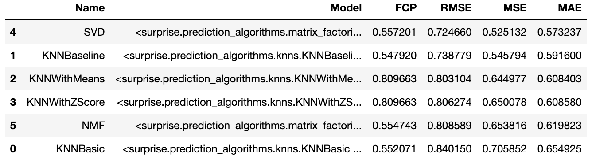
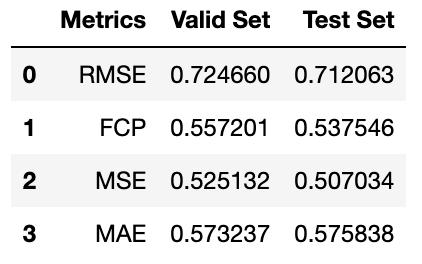

# What to Read Next?: A Book Recommendation System Ready With The Answer

On average people in the US read only 4 books every year. Enthusiasts usually describe decision paralysis of choosing a good book or lack of time to go to a bookstore and research books. Book of the Quarter is set out to make fiding books a lot simpler and effecient through a quaraterly book subscribtion system. In this project, we build a recommendation system for book recommendations using Book-Crossing Communnity and Google Books API dataset. Our model is able to predict user ratings within 0.5-0.7 ratings point on a scale of 1-5. These ratings are subsequently used to select to provide recommendations for different use cases.



## Problem Overview
Book of the Quarter wants to start a quarterly book care package subscribtion service where 5 books will be deliveredto the User and the user can keep aas many aaas they desire and will be chaarged accordingly. Book of the Quarter needs  recommendation system that will be able to recommend books that the users will be inclined to keep so that the revenues and user retention stay high. The want to be able to handle three different scenarios:

1. Current User or user whose demographic and user-book interactions data is available
2. New User whose use demographic information is available but user-book interaction data is not available
3. New User whose user demographic aand user-book interaction data is not available.

Since Book of the Quarter is a startup, we don't have any current user information available to us. Nonetheless, We can use real-world data to create a model that new users can be mapped onto and recommended books accordingly.

## Data Sources
The following datasets are used.

Ratings: https://www.kaggle.com/datasets/arashnic/book-recommendation-dataset?select=Ratings.csv
Books: https://www.kaggle.com/datasets/arashnic/book-recommendation-dataset?select=Books.csv
Users: https://www.kaggle.com/datasets/arashnic/book-recommendation-dataset?select=Users.csv

The books dataset is further expanded using the Google Books API: https://developers.google.com/books

The file whic can be found [here](books-api-data.ipynb) can be used to import data from the Google Books API and store it in a csv file named `book_api_df.csv`

## Data Cleaning and EDA
The normal data cleaning was done for missing values and outliers in conjunction with Exploratory Data Analysis. Almost 4600 Book and 61,000 User records were used for clustering the two datasets independently. TF-IDF and NLP was also used to bin approximately 11,000 unique book genres/categories into common bin. After pre-processing, approximately 12,000 records were used for modelling while 13,000 didn't have book ratings therefore were used as simulations for scenario 1.

A few important things that were discovered and formed the basis of filtering for data are listed below.

### Number of Reviews
We did “CI” calculations systematically for a large number of books at a fixed level of confidence: 95%. What this means is, that we can expect the “true” ratings for the books (after thousands of further ratings) to still lie within those earlier Confidence Intervals in 95% of cases.

We ran a bootstrap method to see which number of ratings will work. We ran the maximum number of ratings to see how they will perform and how widespread the confidence interval can be.

We found that number of ratings greater than 19 brings staabilizes the ratings and makes the difference only 0.6 rating points

### Page Counts
On average a novel is 200 pages and we found that 64% of the books in our dataset had less than 300 pages. To ensure user retention, we wanted to recommend boks that could be completed in a reasonable time therefore we filtered for books with paages less thaan 300.




### Countries
Almost 55% of the data amongst the Top 10 countries was dominated by US users. Therefore the recommendation system was geared towards the US population considering US has the biggest market cap.



## Clustering
Clustering was performed on books and users datasets independently and PCA was used to optimize the amount of features that were used.

### Books
PCA results are shown below that brought down the features from ~1750 to 5 accounting for 87% of the explained variance. Clutering resulted in 9 clusters.




### Users
PCA results are shown below that brought down the features from ~60 to 5 accounting for 72% of the explained variance. Clutering resulted in 11 clusters.



## Modeling and Evaluation
The following models were tested and compared. The models and the evaluation metrics employed can be seen in the picture below.

RMSE was chosen as the main metric to select the final model because accuracy is important in predicting the ratings for unknown data. The top books were ranked based on the predicted ratings.

As shown in the table below, SVD was the top performing and was chosen as the final model.




The final model results are shown in the table below.



## Recommendation System

### Scenario 1
a hybrid approach recommendation system was built using user and content baased collabortive filtering in conjunction with the final model.

The results for a test case were as follows:

Top 5 Books recommended:
<br>
1 Don't Stand Too Close to a Naked Man
<br>
2 I'm Not Really Here
<br>
3 The Cat Who Could Read Backwards
<br>
4 The Chosen
<br>
5 Slow Waltz in Cedar Bend
<br>
---------------------------------------------------------------------------------------------------------
<br>
Top Books originally rated top 5 by user:
<br>
1 This Year It Will Be Different: And Other Stories
<br>
2 Isle of Dogs
<br>
3 Purity in Death
<br>
4 Proxies
<br>
5 Left Behind: A Novel of the Earth's Last Days (Left Behind #1)

### Scenario 2
For Scenario 2, a user-based collaborative filtering recommendation system was created that found books liked by similar users and predicted the rating for the target user for those books using the final model. Feedback from the user on these books can be used in the hybrid recommendation system to formulate 5 solid book recommendations.

A sample case result was as follows

Top 10 Books recommended for feedback:
1 Love You Forever
2 Scientific Progress Goes 'Boink':  A Calvin and Hobbes Collection
3 Kindred (Black Women Writers Series)
4 Rosencrantz &amp; Guildenstern Are Dead
5 The Blue Day Book
6 The Great Gatsby
7 Snow Falling on Cedars
8 Grendel
9 The Stranger
10 The Girl Who Loved Tom Gordon


### Scenario 3
For Scenario 3, the highest average rated books in the highest average cluster were used to recommend 10 books for feedback that could be used iteratively in the Hybrid approach since the user will have to sign up for the service to provide feedback.

The books that will be recommended to users in this category will be the same unless the datasets are updated. The books will be:

The Hobbit, Or, There and Back Again
Battlefield of the Mind
The Quiltmaker's Gift
Ideals Christmas, 1986
Hinds' Feet on High Places
Big Thoughts for Little People
Yukon Ho!
Life on the Other Side
Rome Sweet Home
When God Whispers Your Name


## Conclusion
The recommendation system models provided are able to cater to the 3 most common scenarios in the user journey and assisst in funneling more users but there is still a lack of data on multiple fronts. Nonetheles, these recommendation models will be a good start for the MVP for the company. More data and user-feedback alongside the improvementss mentioned in the next section can be incorporated to significantly increase the performance of the models and prepare them for production.

## Recommendation and Next Steps
The recommendation system provides valuable recommendations but needs improvement due to high RMSE scores and limited data. To enhance performance, gathering more data from sources like Amazon and Goodreads is suggested. The MVP model can address user acquisition and retention scenarios, requiring an authorization system for social media logins. Scenario 2 involves presenting users with top 10 book recommendations and summaries during sign-up, generating data for Scenario 1's hybrid approach. Scenario 3 follows a similar approach, soliciting user feedback to build a user portfolio. A pipeline with a feedback loop should be created to automate user recognition and update datasets and models based on customer input.

## Repository Navigation
Please use the following links to access relevant files:

1. Click [here](notebook.ipynb) to see the full analysis

2. Click [here](Stakeholder_Presentation.pptx) to see the overview presentation.

All the pictures in the ReadMe can be found in the pics folder.

The notebook iterations folder contains the multiple iterations of notebooks.

The pdfs of the presentation, notebook and GitHub repo is stored in the pdfs folder

To reproduce this notebook, please follow the following steps:

1. Use the file [here](requirements.txt) to ensure that you are operating all the correct libraries

2. Use the data source links provided above in the Data Sources section to extract the dataa and store it in a folder labelled 'data'

3. Use books-api-data.ipynb which can be found [here](books-api-data.ipynb) to extract information from the Google Books API.

4. Run the code!

```
├── pdfs
├── pics
├── notebook.ipynb
├── Stakeholder_Presentation.pptx
├── books-api-data.ipynb
├── requirements.txt
└── README.md